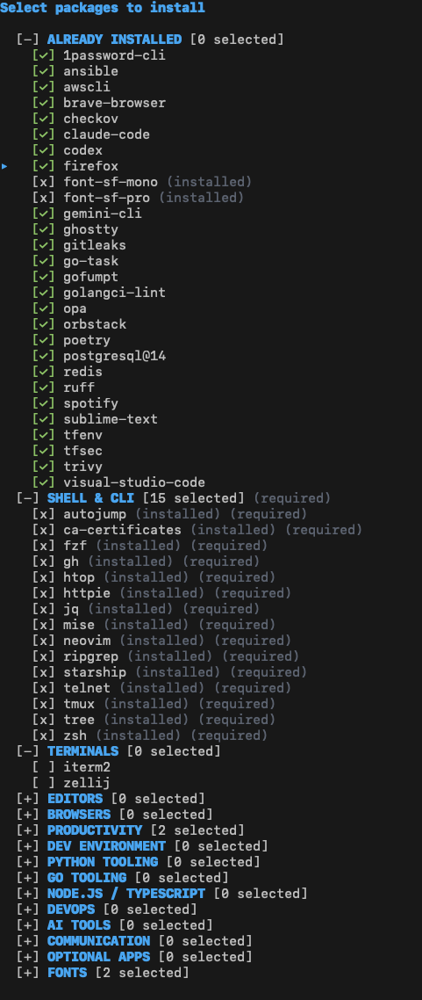
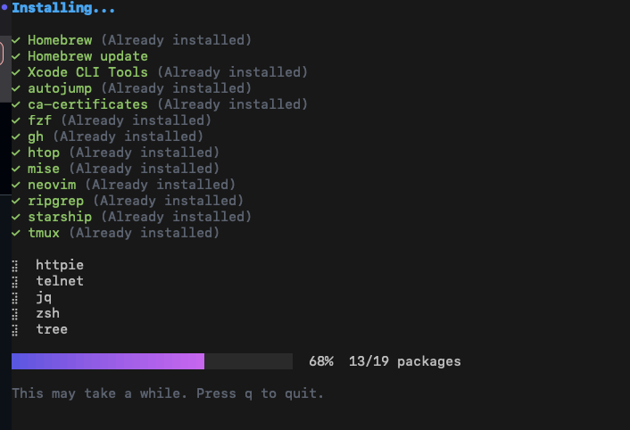
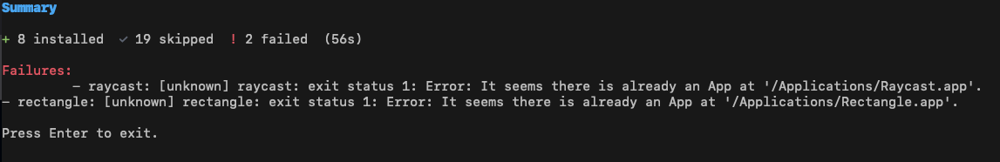

# mac-setup

> An interactive CLI tool to bootstrap and configure macOS (Apple Silicon) for development.


A TUI-based onboarding tool for setting up fresh MacBooks. It installs Homebrew, development tools (Zsh, Neovim, Tmux, Git), applications (Terminals, Editors, Browsers), and manages dotfiles idempotently.

## Features

*   **Interactive TUI**: Select exactly what you want to install.
*   **Idempotent**: Safe to run multiple times; detects installed apps and backups existing configs.
*   **Smart Detection**: Identifies already installed packages and groups them separately.
*   **Flexible Reinstall**: Keep installed packages checked to reinstall them, or uncheck to skip.
*   **Parallel Installation**: Fast installation using concurrent workers.
*   **Real-time Progress Tracking**: Visual progress bar with organized installation status:
    *   Completed packages displayed in green (sorted alphabetically)
    *   Failed packages highlighted in red with error details
    *   Currently installing packages shown with spinner
    *   Overall progress bar showing completion percentage
*   **Dotfile Management**: Automatically configures Zsh, Starship, Neovim (Kickstart), and Tmux/Zellij.

## Screenshots

### Interactive Selection


### Real-time Installation Progress


### Installation Summary


## Quick Start (One-Liner)

To set up a fresh Mac, simply run this command in your terminal:

```bash
/bin/bash -c "$(curl -fsSL https://raw.githubusercontent.com/Dinesh7N/mac-setup/main/install.sh)"
```

This script will:
1.  Check for Apple Silicon (M1/M2/M3).
2.  Download the latest release binary.
3.  Launch the setup tool.

## Installation Categories

*   **Core**: Homebrew, Xcode CLI Tools (Required).
*   **Shell**: Zsh, Oh My Zsh, Starship, plugins (autosuggestions, syntax-highlighting).
*   **Terminals**: Ghostty, iTerm2, Zellij.
*   **Editors**: VS Code, Zed, Sublime Text, Neovim.
*   **Dev Tools**: Docker (OrbStack), Postgres, Redis, Python/Go/Node.js tooling.
*   **Apps**: Browsers, Productivity tools, Fonts.

## Manual Usage

### Build from Source

Requirements: Go 1.21+

```bash
# Clone the repo
git clone https://github.com/Dinesh7N/mac-setup.git
cd mac-setup

# Install task runner (optional, or use go build)
go install github.com/go-task/task/v3/cmd/task@latest

# Build
task build

# Run
`./bin/macsetup` or `task run`
```

### CLI Options

```bash
# Run in headless mode (installs default packages without TUI)
./bin/macsetup --headless

# Dry run (simulate actions without changes)
./bin/macsetup --dry-run

# Increase verbosity
./bin/macsetup --verbose
```

## Contributing

Pull requests are welcome! Please ensure code is formatted and linted before submitting.

### Prerequisites

Install the required development tools:

```bash
# Install golangci-lint for linting
brew install golangci-lint

# Install gofumpt for formatting
brew install gofumpt

# Install task runner (optional but recommended)
brew install go-task
```

### Development Workflow

```bash
# Format code with gofumpt
task format

# Run linter (will format first, then lint)
task lint

# Run both format and lint
task check

# Run tests
task test

# Build the binary
task build
```

## Release Process (Maintainers)

To create and publish a new release, use the automated release task:

### Automated Release (Recommended)

```bash
# Using Task runner (recommended)
task release VERSION=v0.0.2

# Or directly using the script
./scripts/release.sh v0.0.2
```

This will automatically:
1. Validate the version format
2. Check for uncommitted changes
3. Build the binary with version info
4. Create and push a git tag
5. Upload the binary to GitHub releases

**Requirements**:
- GitHub CLI (`gh`) installed: `brew install gh`
- Authenticated with GitHub: `gh auth login`

### Manual Release (Alternative)

If you prefer manual steps:

```bash
VERSION=v0.0.2

# 1. Build the binary
go build -ldflags "-s -w -X main.version=${VERSION}" -o bin/macsetup-darwin-arm64 .

# 2. Create and push git tag
git tag -a ${VERSION} -m "Release ${VERSION}"
git push origin ${VERSION}

# 3. Upload to GitHub releases
gh release upload ${VERSION} bin/macsetup-darwin-arm64 --clobber
```

**Note**: The `install.sh` script automatically pulls the latest release asset named `macsetup-darwin-arm64`, so the binary name must match exactly.

## Troubleshooting

If the installation fails, the logs are automatically saved to:
```bash
/tmp/macsetup.log
```

Please attach this file when opening an issue.

## License

MIT